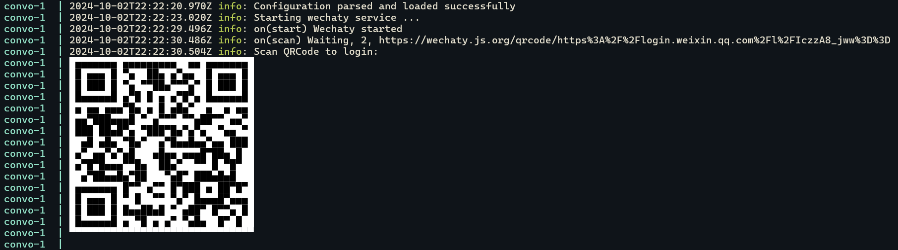

<!-- Improved compatibility of back to top link: See: https://github.com/othneildrew/Best-README-Template/pull/73 -->
<a id="readme-top"></a>

<!-- [![MIT License][license-shield]][license-url] -->
<!-- [![LinkedIn][linkedin-shield]](linkedin-url) -->

<!-- PROJECT LOGO -->
<br />
<div align="center">
  <!-- <a href="https://github.com/linj121/convo">
    
  </a> -->

  <h1 align="center">Convo</h1>

  <p align="center">
    <i>Bring automation to your instant messaging app</i>
    <!-- <br />
    <a href="https://github.com/linj121/convo"><strong>Explore the docs »</strong></a>
    <br /> -->
    <!-- <br />
    <a href="https://github.com/linj121/convo">View Demo</a>
    ·
    <a href="https://github.com/linj121/convo/issues/new?labels=bug&template=bug-report---.md">Report Bug</a>
    ·
    <a href="https://github.com/linj121/convo/issues/new?labels=enhancement&template=feature-request---.md">Request Feature</a> -->
  </p>
  <p align="center">
    <a href="https://github.com/linj121/convo/actions/workflows/ci.yml/badge.svg"></a>
    <a href="https://github.com/linj121/convo/blob/main/LICENSE.txt"></a>
  </p>
</div>

<!-- TABLE OF CONTENTS -->
<details>
  <summary>Table of Contents</summary>
  <ol>
    <li>
      <a href="#about-convo">About Convo</a>
      <ul>
        <li><a href="#features">Features</a></li>
        <li><a href="#built-with">Built With</a></li>
      </ul>
    </li>
    <li>
      <a href="#usage">Usage</a>
      <ul>
        <li><a href="#app-login">App Login</a></li>
        <li><a href="#plugin-manager">Plugin Manager</a></li>
      </ul>
    </li>
    <li>
      <a href="#getting-started">Getting Started</a>
      <ul>
        <li><a href="#develop--deploy-in-your-os">Develop / Deploy in your OS</a></li>
        <ul>
          <li><a href="#prerequisites">Prerequisites</a></li>
          <li><a href="#installation">Installation</a></li>
        </ul>
        <li><a href="#develop--deploy-using-docker">Develop / Deploy using Docker</a></li>
        <ul>
          <li><a href="#prerequisites-1">Prerequisites</a></li>
          <li><a href="#deploy-a-prebuilt-image">Deploy a Prebuilt Image</a></li>
          <li><a href="#build-your-own-image">Build Your Own Image</a></li>
          <li><a href="#develop-in-dev-container">Develop in Dev Container</a></li>
        </ul>
        <li><a href="#environment-variables">Environment Variables</a></li>
      </ul>
    </li>
    <li><a href="#roadmap">Roadmap</a></li>
    <li><a href="#contributing">Contributing</a></li>
    <li><a href="#how-it-works">How it works</a></li>
    <li><a href="#contact">Contact</a></li>
  </ol>
</details>


## About Convo

Automate conversations, services and more in your instant messaging apps!

*Currently supported app: Wechat*

### Features

- **Plugin System**: Easily view and manage plugins directly within the app.
- **Conversational Chatbot**:
  - Remembers conversation context for both private and group chats.
  - Responds in both text and audio formats.
- **Habit Tracker Plugin**:
  - Motivates users with positive messages each time they track a habit.
- **Holiday Blessing Plugin**:
  - Sends holiday greetings and well wishes.
- **Upcoming Features**: More exciting features on the way (See [roadmap](#roadmap))

### Built With

<!-- * [![Next][Next.js]][Next-url]
* [![React][React.js]][React-url]
* [![Vue][Vue.js]][Vue-url] -->
* [![Typescript][Typescript.com]][Typescript-url]
* [![Prisma][Prisma.com]][Prisma-url]
* [![OpenAI][OpenAI.com]][OpenAI-url]
* [![Wechaty][Wechaty.com]][Wechaty-url]

<p align="right"><a href="#readme-top">Back to Top</a></p>


## Usage

### App Login

Once the project is deployed/started, a QR Code will show up in standard output. 

Scan it to log into your app.




### Plugin Manager

A CLI-like tool for managing plugins.

Use it **within** your instant messaging apps (Wechat, WhatsApp, etc).

```text
Plugin Manager
• Usage: /plugin [OPTION]
• Option:
-l | --list     list all plugins
-e | --enable  [N] enable plugin number N
-d | --disable [N] disable plugin number N
-h | --help     display help message
• Example:
/plugin --list
/plugin --disable 2
/plugin -e 1
/plugin -h
```

- Send `/plugin --list` or `/plugin -l` to explore plugins and their usage!

- `/plugin --enable [N]` and `/plugin --disable [N]` are admin commands. Admin is the currently logged-in user. 

<p align="right"><a href="#readme-top">Back to Top</a></p>


## Getting Started

For **end-users**, [deploy using prebuilt image](#deploy-a-prebuilt-image) is highly recommended.

### Develop / Deploy in your OS

#### Prerequisites

* Node.js >= v20.x.x. [Installation Guide](https://nodejs.org/en/download/)

* PNPM. Run `corepack enable pnpm && corepack install` or see instructions [here](https://pnpm.io/installation).
  
* GNU Make. [Windows Installation](https://stackoverflow.com/questions/32127524/how-to-install-and-use-make-in-windows)

#### Installation


1. Install and build
   
   ```sh
   make
   ```
   No GNU Make? No worries. Just run `pnpm install && pnpm migrate:prod && pnpm build`
 
2. Configuration
   
   ```sh
   cp .env.example .env
   ```
   Edit `.env` and fill out all **required** fields. See [this section](#environment-variables) for more.
3. Start
   
   ```sh
   pnpm start
   ```
   **Optional**: Set `NODE_ENV=production` to get a production deployment. eg. `NODE_ENV=production pnpm start`

> [!NOTE] 
> If you see any error related to "Chrome" or "Puppeteer", there might be some missing dependencies(shared objects) required for the chrome binary, which can be verified using the `ldd` command. Try running `make fixdeps` and start again. For now `make fixdeps` only supports Debian based linux distros and Alpine Linux. If your OS isn't supported, consider using **Docker/Dev Container** instead.


<p align="right"><a href="#readme-top">Back to Top</a></p>

### Develop / Deploy using Docker

#### Prerequisites

- Docker Engine. [Installation Guide](https://docs.docker.com/engine/install/)

#### Deploy a Prebuilt Image

1. Configuration
   
   ```sh
   cp .env.example .env
   ```
   Edit `.env` and fill out all **required** fields. See [this section](#environment-variables) for more. 

2. Deploy 
   
   ```sh
   sudo docker compose up -d
   sudo docker compose logs -f
   ```

#### Build Your Own Image

1. Option 1. Build a new image only.

   ```sh
   make image
   ```
   Or `sudo docker build -t convo:devbuild .`
2. Option 2. Build and deploy the new image.

   ```sh
   sudo docker compose -f docker-compose-dev.yaml up --build
   ```

#### Develop in Dev Container

1. Open this project in VS Code or Github Codespaces. [Instructions](https://code.visualstudio.com/docs/devcontainers/containers)

2. Configuration
   
   ```sh
   cp .env.example .env
   ```
   Edit `.env` and fill out all **required** fields. See [this section](#environment-variables) for more. 

3. Install and Build
   
    ```sh
    make
    ```
4. Start

   ```sh
   pnpm start
   ```

<p align="right"><a href="#readme-top">Back to Top</a></p>

### Environment Variables

| Environment Variable              | Required/Optional                  | Default                                         | Description                                                                                            |
|-----------------------------------|------------------------------------|-------------------------------------------------|--------------------------------------------------------------------------------------------------------|
| `OPENAI_API_KEY`                  | **Required**                       | N/A                                             | The key for OpenAI API. [Doc](https://platform.openai.com/docs/quickstart/create-and-export-an-api-key)|
| `OPENAI_MODEL`                    | Optional                           | `gpt-4o-mini`                                   | The OpenAI model to use. [Doc](https://platform.openai.com/docs/models)                                |
| `OPENAI_PROJECT_ID`               | Optional                           | `""`                                            | Project ID for OpenAI                                                                                  |
| `OPENAI_TTS_VOICE`                | Optional                           | `onyx`                                          | TTS Voice option: onyx, alloy, echo, fable, nova, shimmer. [Doc](https://platform.openai.com/docs/guides/text-to-speech/voice-options) |
| `ASSISTANT_PROMPT_DEFAULT`        | Optional                           | `""`                                            | Default prompt for default openai assistant                                                            |
| `ASSISTANT_PROMPT_HABIT_TRACKER`  | Optional                           | `""`                                            | Default prompt for openai assistant in habit tracker                                                   |
| `WECHATY_CHATBOT_NAME`            | Optional, but **recommended**      | `["jarvis"]`                                    | Names of the chatbot, separated by commas `,`. By default, invoke chatbot by `@jarvis`. eg. If you put `jarvis, xqc, speed`, you can invoke the chatbot by either `@jarvis`, `@xqc` or `@speed`.|
| `WECHATY_GROUPCHAT_WHITELIST`     | Optional, but **recommended**      | `[""]`                                          | Names of group chats to be whitelisted for chatbot, separated by commas `,`. By default, chatbot is disabled for all group chats. Enable the chatbot by providing names of target group chats. eg. `ecorp, family, fsociety` |
| `WECHATY_CONTACT_WHITELIST`       | Optional, but **recommended**      | `[""]`                                          | Names of contacts to be whitelisted for chatbot, separated by commas `,`. By default, chatbot is disabled for all contacts. Enable the chatbot by providing **names (NOT alias)** of target contacts. eg. `mr.robot, elliot, white rose` |
| `LOG_LEVEL`                       | Optional                           | `info` if in production mode, `debug` otherwise | error, warn, info, http, verbose, debug, silly [Doc](https://github.com/winstonjs/winston?tab=readme-ov-file#logging-levels)           |
| `DATABASE_URL`                    | Optional                           | `./localdb/default.db`                          | Location of Sqlite3 DB file. WARNING: Use this only if you know what you're doing!                     |


<p align="right"><a href="#readme-top">Back to Top</a></p>


## Roadmap

- [x] Persist thread context locally
- [x] Send audio message using TTS(Text to Speech)
- [x] Plugin Manager
- [ ] Task Scheduler
- [ ] REST API + Websocket server for modifying configuration/states and receiving/sending messages
- [ ] Web UI for better user experience
    - [ ] User authentication
    - [ ] Configuration Editor
    - [ ] Plugin Management
    - [ ] Task Editor
    - [ ] Realtime interface for receiving/sending msgs
    - [ ] Better command line interface (auto complete, hints, validation, etc)

<p align="right"><a href="#readme-top">Back to Top</a></p>


## How it works

```text
  +-------------------------------------------------------+      
  |                    Convo UI (Todo)                    |
  +-------------------------------------------------------+      
  +-------------------------------------------------------+      
  |                     Convo Server                      |
  +-------------------------------------------------------+      
  +-------------------------------------------------------+
  |                      Wechaty SDK                      |
  +-------------------------------------------------------+
  +-------------------------------------------------------+
  |                 Wechaty Puppet Service                |
  +-------------------------------------------------------+
+---------------------  wechaty_grpc  ----------------------+
  +-------------------------------------------------------+
  |                    Wechaty Puppet                     |
  +-------------------------------------------------------+
  +-------------------------------------------------------+
  |                     Web Protocol                      |
  |                (wechaty-puppet-wechat)                | <--- Puppeteer, based on Chromium
  +-------------------------------------------------------+
```

[Wechaty](https://wechaty.js.org/docs/wechaty) is a third-party, open-source conversational RPA SDK.

Web Protocol implementation for Wechat is provided by [wechaty-puppet-wechat](https://github.com/wechaty/puppet-wechat).

\* Architecture [Reference](https://wechaty.js.org/docs/explanations/architecture)

<p align="right"><a href="#readme-top">Back to Top</a></p>

## Contributing

Any bug fix, new feature, etc are greatly appreciated!

1. Fork the Project
2. Create your Branch (`git checkout -b feature/someFeature`)
3. Commit your Changes (`git commit -m 'feat: Add some feature'`)
4. Push to the Branch (`git push origin feature/someFeature`)
5. Open a Pull Request

*To develop new plugins, simply extend `PluginBase` and register your plugin in `src/services/wechatyService/plugins/pluginRegistration.ts`*

<!-- ### Top contributors:

<a href="https://github.com/linj121/convo/graphs/contributors">
  
</a> -->

## Contact

Josh Lin - joshlin.dev@gmail.com

<p align="right"><a href="#readme-top">Back to Top</a></p>

<!-- ACKNOWLEDGMENTS -->
<!-- ## Acknowledgments -->
<!-- <p align="right"><a href="#readme-top">Back to Top</a></p> -->


<!-- MARKDOWN LINKS & IMAGES -->
<!-- https://www.markdownguide.org/basic-syntax/#reference-style-links -->
[contributors-shield]: https://img.shields.io/github/contributors/linj121/convo.svg?style=for-the-badge
[contributors-url]: https://github.com/linj121/convo/graphs/contributors
[forks-shield]: https://img.shields.io/github/forks/linj121/convo.svg?style=for-the-badge
[forks-url]: https://github.com/linj121/convo/network/members
[stars-shield]: https://img.shields.io/github/stars/linj121/convo.svg?style=for-the-badge
[stars-url]: https://github.com/linj121/convo/stargazers
[issues-shield]: https://img.shields.io/github/issues/linj121/convo.svg?style=for-the-badge
[issues-url]: https://github.com/linj121/convo/issues
[license-shield]: https://img.shields.io/github/license/linj121/convo.svg?style=for-the-badge
[license-url]: https://github.com/linj121/convo/blob/main/LICENSE.txt
[linkedin-shield]: https://img.shields.io/badge/-LinkedIn-black.svg?style=for-the-badge&logo=linkedin&colorB=555
[linkedin-url]: https://linkedin.com/in/linkedin_username
[product-screenshot]: images/screenshot.png
<!-- [Next.js]: https://img.shields.io/badge/next.js-000000?style=for-the-badge&logo=nextdotjs&logoColor=white
[Next-url]: https://nextjs.org/
[React.js]: https://img.shields.io/badge/React-20232A?style=for-the-badge&logo=react&logoColor=61DAFB
[React-url]: https://reactjs.org/
[Vue.js]: https://img.shields.io/badge/Vue.js-35495E?style=for-the-badge&logo=vuedotjs&logoColor=4FC08D
[Vue-url]: https://vuejs.org/ -->
[Nodejs.com]: https://img.shields.io/badge/Node.js-339933?style=for-the-badge&logo=nodedotjs&logoColor=white
[Nodejs-url]: https://nodejs.org/
[Typescript.com]: https://img.shields.io/badge/TypeScript-007ACC?style=for-the-badge&logo=typescript&logoColor=white
[Typescript-url]: https://www.typescriptlang.org/
[Wechaty.com]: https://img.shields.io/badge/Wechaty-00C775?style=for-the-badge&logo=wechaty&logoColor=white
[Wechaty-url]: https://wechaty.js.org/
[Prisma.com]: https://img.shields.io/badge/Prisma-2D3748?style=for-the-badge&logo=prisma&logoColor=white
[Prisma-url]: https://www.prisma.io/
[OpenAI.com]: https://img.shields.io/badge/OpenAI-412991?style=for-the-badge&logo=openai&logoColor=white
[OpenAI-url]: https://openai.com/